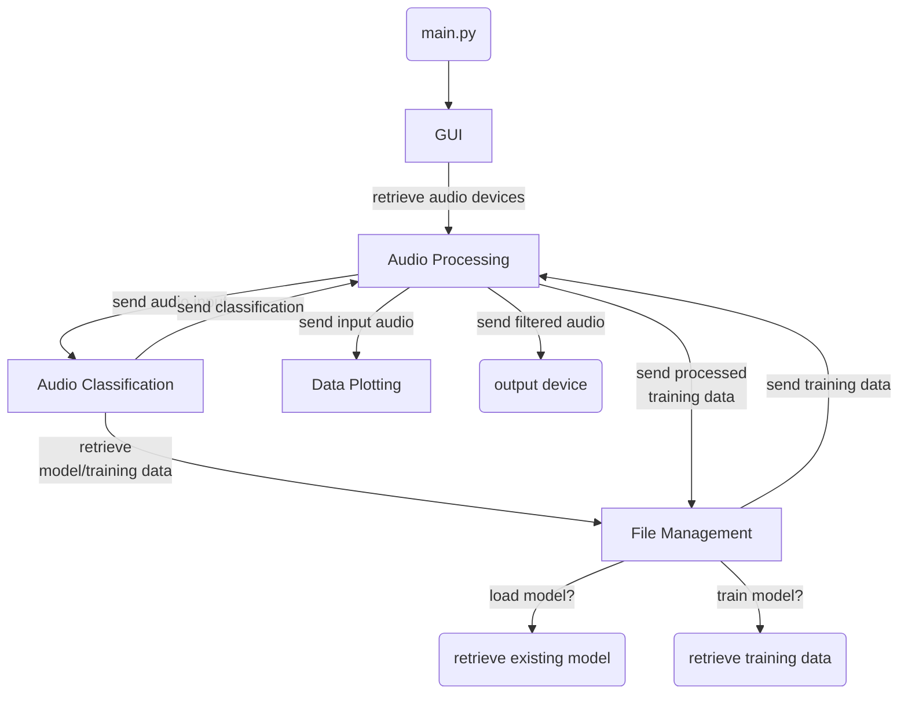

# BabyBash
*Architecture*

## Table of Contents
- [Overview](../README.md)
- [Installation & Usage](installation.md)
  - [Requirements](installation.md#requirements)
  - [Installation](installation.md#installation)
  - [Usage](installation.md#usage)
- Architecture
  - [Architecture Overview](#architecture-overview)
  - [Software Components](#software-components)
  - [Assumptions](#assumptions)
  - [Alternative Architectures](#alternative-architectures)
- [Design](design.md)
  - [Modules](design.md#modules)
  - [Coding Guidelines](design.md#coding-guidelines)
  - [GitHub Structure](design.md#github-structure)
  - [Process Description](design.md#process-description)
- [Testing & CI](testing.md)
  - [Test Automation](testing.md#test-automation)
  - [Continuous Integration](testing.md#continuous-integration)
  - [Test Cases](testing.md#test-cases)
- [Developer Guidelines](dev_guidelines.md)
  - *(TODO: Complete `dev_guidelines.md`)*

## Architecture Overview
**BabyBash** is designed for real-time audio processing to detect and filter out baby crying sounds. A simplified representation of the program's architecture is outlined in the diagram below.

## Software Components
The architecture of **BabyBash** comprises the following major components:

### 1. GUI
- **Functionality:** Provides a user interface to allow user to choose audio devices.
- **Interface:** Passes chosen devices to the audio processing component.

### 2. Audio Processing
- **Functionality:** Opens input and output streams, reads audio data from input and applies a filter when a baby is detected via `Audio Classification` component, then sends the filtered audio data to the output stream. Also sends input stream data to the `Data Plotting` component to be plotted in real-time, and MFCC data back to the `File Management` component when training a new model.
- **Interface:** Input and output of raw audio stream through specified devices.

### 3. Audio Classification
- **Functionality:** Trains a new model or loads a pre-trained model via `File Management` component. Classifies audio data as either baby crying or no baby crying. Achieved using a simple linear neural network architecture.
- **Interface:** Takes an input of MFCC features in a given block of audio data and outputs a classification.

### 4. Data Plotting
- **Functionality:** Plots the input audio MFCC data from the `Audio Processing` component in real-time to a graph. Indicate when a baby is detected and when the filter is being applied.
- **Interface:** Input of MFCC data, output of graph.

### 5. File Management
- **Functionality:** Provide tools for loading pre-existing models and training data from files, processing data files via `Audio Processing` component, and managing data files.
- **Interface:** Input of file directories, output of data.

## Assumptions
- The user has available audio devices to use for input and output.
- Audio input is continuous and stable.
- Sufficient computational resources for real-time processing.

## Alternative Architectures
### 1. Cloud-based Processing
- **Pros:** Scalability, offloading processing load.
- **Cons:** Latency, privacy concerns, requires internet.

### 2. Dedicated Hardware Processing
- **Pros:** Optimized performance, reliability.
- **Cons:** Higher cost, less flexibility.